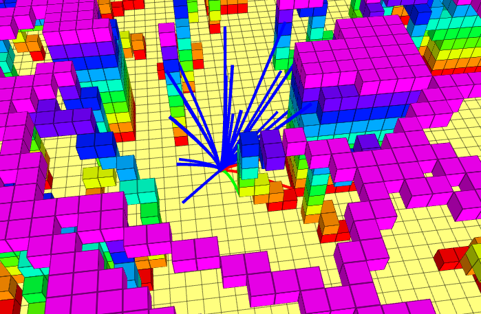

## 实验报告

### 一、算法原理

#### 1.1 前向推导

已知 $s(t) = [p, v]^T$,  $\dot{s}=[v,a]^T$ 控制量 $u = a$;

状态转移方程为:
$$
s(t) = e^{At}s(0)+\int^{t}_{0}{e^{A(t-\tau)}Bud\tau}
$$

其中：
$$
A =\left[ \begin{matrix}
0 &0 &0 &1  &0&0\\
0 &0 &0 &0&1&0 \\
0 &0 &0 &0&0&1 \\
0 &0 &0 &0&0&0 \\
0 &0 &0 &0&0&0 \\
0 &0 &0 &0&0&0 \\
\end{matrix} \right]
$$

$$
B=\left[ \begin{matrix} 
0 &0 &0 \\
0 &0 &0  \\
0 &0 &0  \\
1 &0 &0\\
0 &1&0  \\
0 &0 &1 \\
\end{matrix} \right]
$$

因此，状态转移方程为：
$$
s(t) =\left[ \begin{matrix}
p_0+v_0*t+\frac{1}{2}*a_0*t^2\\
p_1+v_1*t+\frac{1}{2}*a_1*t^2 \\
p_2+v_2*t+\frac{1}{2}*a_2*t^2 \\
v_0+ a_0*t\\
v_0+ a_0*t \\
v_0+ a_0*t \\
\end{matrix} \right]
$$
前向实现为：

    
    

        前向代码实现
    

#### 1.2 反向计算cost值（OBVP）

已知 $s(t) = [p, v]^T$,  $\dot{s}=[v,a]^T$ 控制量 $u = a$;
$$
J = \displaystyle \sum^{i = 3}_{i = 0}{J_k}+T,    \qquad	其中，J_k = \frac{1}{T} \int^{T}_{0}{u_k^2dt}\\
$$

由庞特里亚金最小值原理可得：
$$
H(s,u,\lambda)=\frac{1}{T} u^2+\lambda_1v+\lambda_2u\\
\dot{\lambda}=-\frac{\partial H(s^*,u^*,\lambda)}{\partial s}\\
=[0,\lambda_1]\qquad\quad
$$

因此，可以得到：
$$
\lambda(t)=\frac{1}{T} \left[
\begin{matrix}
2a \\
-2at-2b\\
\end{matrix}\right]
$$
由$u^*(t)=argmin_{u(t)} H(s^*(t),u(t),\lambda(t))$, 可得：
$$
u^*(t)=at+b
$$

$$
s^*(t)=\left[
\begin{matrix}
\frac{a}{6}t^3+\frac{b}{2}t^2+v_0t+p_0\\
\frac{a}{2}t^2+bt+v_0\\
\end{matrix}
\right]
$$

将边界条件带入可得：
$$
\left[
\begin{matrix}
\frac{T^3}{6}&\frac{T^2}{2}\\
T&1
\end{matrix}
\right]
\left[
\begin{matrix}
a\\
b\\
\end{matrix}
\right]
=
\left[
\begin{matrix}
\Delta P\\
0
\end{matrix}
\right]
\qquad\Delta P=p_f-p_0-v_0*T
$$

解得：
$$
\left[
\begin{matrix}
a\\
b
\end{matrix}
\right]
=
\left[
\begin{matrix}
\frac{-3\Delta P}{T^3}\\
\frac{3\Delta P}{T^2}\\
\end{matrix}
\right]
$$
将上式带入J(t)中，可得：
$$
J(T) = \displaystyle \sum^{i = 3}_{i = 0}{J_k}+T,    \qquad	其中，J_k = \frac{3\Delta P^2}{T^4} \\
$$
令$\dot{J} = 0$可得：
$$
T^5-6v_0^2T^2+18mv_0T-12m^2 = 0 \qquad m=p_f-p_0
$$
将上一个公式求解，将T带入J(T),取最小值，即为OBVP问题最小值。

OBVP问题实现：

    
    

       OBVP问题求解实现
    

### 二、算法结果实现

    
    

       结果示例图1
    

    
    

       结果示例图2
    

